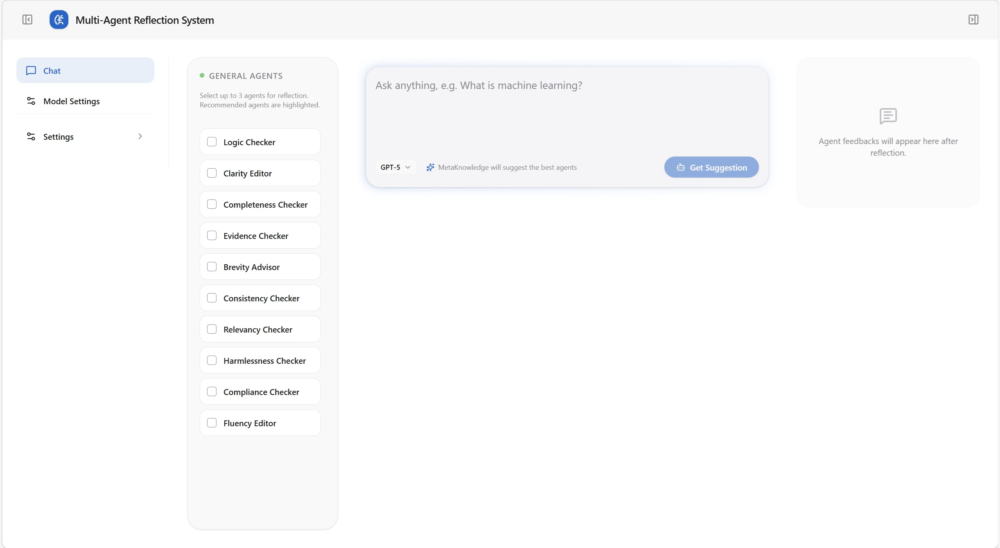
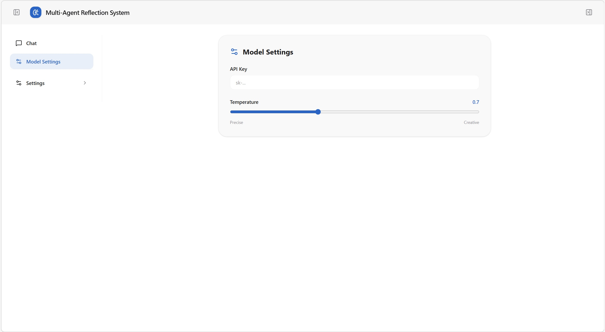
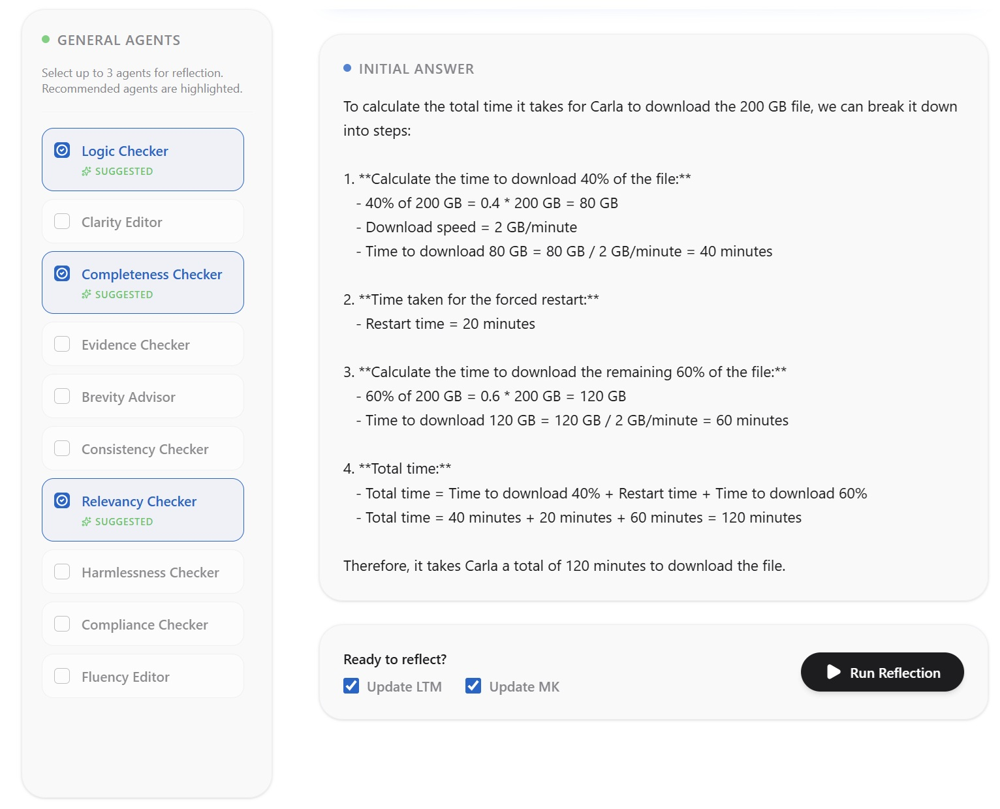
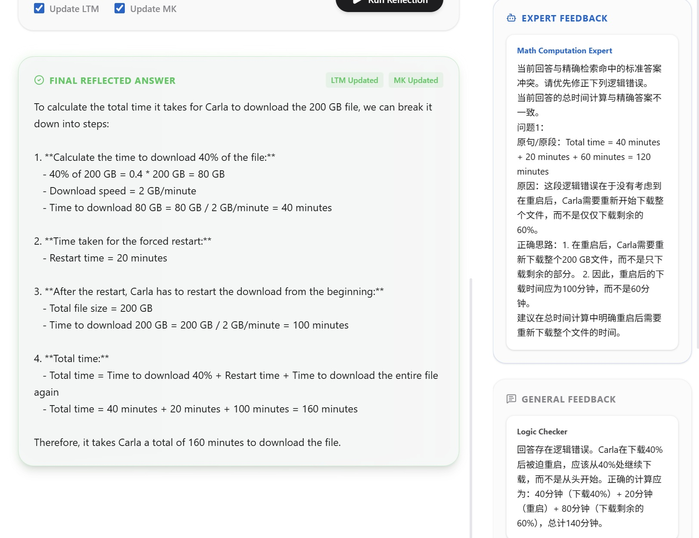

# Multi-Agent Reflection System

A multi-agent self-correction system designed to reduce hallucinations and improve answer quality. The current codebase has evolved into a **two-layer agent architecture**:

- **Student Agent**: generates the initial answer, receives feedback, and revises conservatively
- **Meta-Knowledge (MK)**: handles question classification, agent selection, and stop decisions
- **General Agents**: 10 generic reviewer/editor roles
- **Expert Agents**: 16 task-specific experts, one per question type
- **Insight Agent**: consolidates multi-agent feedback into the next revision guidance

The current main workflow is:

**Student initial answer -> MK classifies and selects agents -> Expert alignment / General review -> Insight consolidation -> Student revision -> MK decides whether to continue -> Final answer**

## Demo

The repository includes a Web demo video showing the full flow from the initial answer to reflective revision:

[Watch the demo video](demo/demo.mp4)

### Home Page

The main interface (**Chat**), from left to right, consists of:

- **Navigation bar** (`Chat` / `Model Settings`; `Settings` at the bottom can be expanded to switch light/dark theme)
- **General Agents panel** (select from 10 general agent types, **up to three**; after `Get Suggestion`, items recommended by Meta-Knowledge are labeled *Suggested*)
- **Center main area** (question input, chat model dropdown, and the subsequent initial answer and final result)
- **Agents Feedbacks column** (after reflection, shows **Expert Feedback** and **General Feedback**; the side bar can be collapsed via the top bar). All such requests carry the API key, temperature, and selected model saved on the Model Settings page



### Model Settings Page

The **Model Settings** page configures LLM calls for the current session: **API Key** (if empty, the frontend prompts you to configure it here first) and **Temperature** (a slider from 0 to 2, labeled `Precise`–`Creative`).



### Get Suggestion

After you click **Get Suggestion**, the **Student** agent combines LTM and MK to produce the **Initial Answer**, and **Meta-Knowledge** selects up to three general agents based on historical performance; the UI checks them automatically and highlights them as *Suggested*.



### Run Reflection

With **Update LTM** / **Update MK** enabled (on by default) and at least one General Agent selected, clicking **Run Reflection** runs the **Expert Agent** (including LTM vector retrieval, etc.) together with your selected general agents to produce feedback. The **right column** renders `expert_feedbacks` and `general_feedbacks` separately. **Below the center main area** is the **Final Reflected Answer**; the result area shows **LTM Updated** / **MK Updated** badges according to the request parameters.



## Current Capabilities

### 1. Dual-layer reflection with General Agents and Expert Agents

The codebase currently includes 10 general agents:

- `logic_checker`
- `clarity_editor`
- `completeness_checker`
- `evidence_checker`
- `brevity_advisor`
- `consistency_checker`
- `relevancy_checker`
- `harmlessness_checker`
- `compliance_checker`
- `fluency_editor`

The codebase currently includes 16 expert categories, each mapped to one Expert Agent:

- `TEXT_WRITING`
- `SUMMARIZATION`
- `CODE_DEVELOPMENT`
- `KNOWLEDGE_QA`
- `EDUCATIONAL_TUTORING`
- `TRANSLATION_LOCALIZATION`
- `CREATIVE_IDEATION`
- `DATA_PROCESSING`
- `ROLE_PLAYING`
- `CAREER_BUSINESS`
- `LIFE_EMOTIONAL`
- `MARKETING_COPYWRITING`
- `LOGICAL_REASONING`
- `MATH_COMPUTATION`
- `MULTIMODAL`
- `OTHER_GENERAL_Q`

Each round uses the following by default:

- **3 general agents**
- **1 expert agent corresponding to the detected question type**

General-agent selection is driven by a **multi-armed bandit (MAB)** strategy. The default algorithm is `ThompsonSampling`.

### 2. Two-stage correction mechanism

When the Expert side hits an exact match in long-term memory, the system prioritizes:

1. **Expert alignment stage**: fix facts, calculations, constraints, and the final conclusion first
2. **General polishing stage**: only improve structure, wording, and clarity to avoid damaging an already aligned answer

If no exact memory is hit, the system falls back to the standard multi-agent review and revision loop.

### 3. Memory system

The project currently contains three kinds of memory:

- **LTM**: long-term memory source file, using a fixed 16-category structure, default path `data/ltm.json`
- **LTM vector store**: runtime retrieval store, using `data/ltm_store.parquet` + `data/ltm_store_embeddings.npy`
- **MK Memory**: policy memory that stores MAB statistics and strategy configuration per question type, default path `data/mk_memory.json`

As a general plugin framework, the repository does not include a ready-to-use `data/ltm.json` in the repository.

In practice:

- Expert knowledge retrieval mainly uses the **runtime vector store**
- LTM retrieval on the Student side is **disabled by default** in the current code, so the initial answer mainly relies on the base model itself
- MK updates its own statistics after each run based on contribution signals
- The system can run **without LTM by default**, but Expert-side retrieval enhancement will be weaker

## Environment Setup

### Python dependencies

Requirements:

- Python 3.10+

Install:

```bash
pip install -r requirements.txt
```

### Frontend dependencies

If you want to develop the frontend locally, also install:

```bash
cd frontend
npm install
```

## Configuration

The main configuration file is `config.py`.

It is recommended to override settings through **environment variables** instead of committing real API keys into the repository.

Current implementation note:

- The default configuration points to the official OpenAI endpoints
- The code still exposes `OPENAI_BASE_URL`, `OPENAI_BASE_EMBEDDING_URL`, and `JUDGE_BASE_URL` as configurable values
- If you use a third-party OpenAI-compatible gateway, actual behavior depends on that gateway's compatibility with the current request/response format

The core configuration items currently used by the code include:

- `OPENAI_API_KEY`: API key for the main chat model
- `OPENAI_BASE_URL`: base URL for the OpenAI API; keep the default official endpoint unless you are modifying the code yourself
- `OPENAI_MODEL`: default chat model
- `OPENAI_TEMPERATURE`: default temperature
- `OPENAI_EMBEDDING_MODEL`: embedding model
- `OPENAI_API_EMBEDDING_KEY`: API key used for embeddings
- `OPENAI_BASE_EMBEDDING_URL`: base URL for the embedding API; keep the default official endpoint unless you are modifying the code yourself
- `JUDGE_API_KEY`: judge-model API key used by `judge_eval.py`
- `JUDGE_BASE_URL`: judge endpoint URL
- `JUDGE_MODEL`: judge model name

In addition, `cfg/conf.json` can be used to supplement some configuration items such as `DEFAULT_QUESTION_TYPE`.

### Recommended setup

Windows PowerShell example:

```powershell
$env:OPENAI_API_KEY="your-key"
$env:OPENAI_BASE_URL="https://api.openai.com/v1/"
$env:OPENAI_MODEL="gpt-4.1"
$env:OPENAI_API_EMBEDDING_KEY="your-key"
$env:OPENAI_BASE_EMBEDDING_URL="https://api.openai.com/v1/"
```

### Optional: initialize the LTM retrieval store

The repository does not ship with a ready-to-use `data/ltm.json` or derived vector-store files by default.

If you want to run the system directly with the prepared knowledge base, download:

- `agent_auto_correction_ltm`
- Link: [https://pan.baidu.com/s/5sC_hU5fYaWlwjfQmN5wcYQ](https://pan.baidu.com/s/5sC_hU5fYaWlwjfQmN5wcYQ)

If you want to use your own knowledge base, prepare `data/ltm.json`, `data/ltm_store.parquet`, and `data/ltm_store_embeddings.npy` yourself.

Notes:

- If `data/ltm.json`, `data/ltm_store.parquet`, and `data/ltm_store_embeddings.npy` are all missing, the system can still run
- Without the vector store, Expert-side retrieval enhancement degrades to a "no knowledge hit" mode

### Temporary model overrides from the frontend

The Web page supports passing the following values in the **request context of a single run** through "Model Settings":

- API Key
- Temperature
- Model

These values override backend defaults, but only for the current request.

The code currently expects an API key that works with the configured backend endpoint.

## How to Run

### 1. Run the Web service

The most complete way to use the project is currently FastAPI + the frontend page:

```bash
uvicorn app:app --reload --host 0.0.0.0 --port 8000
```

Then open:

- [http://localhost:8000](http://localhost:8000)

The current page supports:

- entering a question and getting system suggestions
- viewing the Student initial answer
- selecting up to 3 General Agents
- running multi-round reflection
- viewing Expert / General feedback
- entering API key, model, and temperature on the page

Health-check endpoint:

```text
GET /health
```

### 2. Frontend development mode

The frontend source code is located in `frontend/` and uses Vite.

Development mode:

```bash
cd frontend
npm run dev
```

The current `vite.config.ts` is configured with:

- `/api` proxied to `http://127.0.0.1:8000`
- build output directory set to `static/` under the project root

Build static assets:

```bash
cd frontend
npm run build
```

After building, the generated files directly replace the backend-served `static/` directory.

### 3. Python batch execution

`main.py` currently serves two roles:

- as a **function entry point** called by the Web backend: single-question interactions from the frontend call `get_suggest()` and `run_system()`
- as a **command-line entry point** for dataset-based batch execution: the `if __name__ == "__main__"` block parses `--dataset` and `--output`

Example:

```bash
python main.py --dataset dataset/GSM8K.json --output output/results.json
```

The output includes:

- original question
- first answer
- final answer
- elapsed time
- token statistics

Note: the default `testdata/test.json` and `testdata/results.json` referenced in code may not exist in the current repository state. It is recommended to pass `--dataset` and `--output` explicitly.

### 4. Judge evaluation

You can use `judge_eval.py` to evaluate consistency on a dataset:

```bash
python judge_eval.py --dataset dataset/GSM8K.json --limit 10
```

This script will:

- call `run_system()` to generate answers
- call a separate Judge model to compare predictions with reference answers
- output accuracy, elapsed time, and token statistics

Judge-related environment variables:

- `JUDGE_API_KEY`
- `JUDGE_BASE_URL`
- `JUDGE_MODEL`

## API

### `POST /api/suggest`

Used to get, for a single question:

- Student initial answer
- question type
- candidate question types
- MK-recommended General Agents

Request example:

```json
{
  "question": "Why does deep learning usually require a large amount of data?",
  "api_key": "sk-...",
  "temperature": 0.3,
  "model": "gpt-4.1"
}
```

### `POST /api/run`

Used to execute the single-question reflection flow and return:

- final answer
- Expert feedback
- General feedback

Request example:

```json
{
  "question": "Why does deep learning usually require a large amount of data?",
  "selected_agents": [
    "logic_checker",
    "clarity_editor",
    "completeness_checker"
  ],
  "update_ltm": true,
  "update_mk": true,
  "api_key": "sk-...",
  "temperature": 0.3,
  "model": "gpt-4.1"
}
```

If the frontend has already called `/api/suggest`, the following fields can also be passed to `/api/run` to reuse the initial answer and avoid generating it again:

- `initial_answer`
- `question_type`
- `candidate_question_types`

## Memory Files and Runtime Data

Key memory-related files in the project:

- `data/ltm.json`
- `data/mk_memory.json`
- `data/ltm_store.parquet`
- `data/ltm_store_embeddings.npy`

Notes:

- The repository does not ship with a ready-to-use `data/ltm.json`
- If you want to run the system directly with the prepared knowledge base, download `agent_auto_correction_ltm` from Baidu Netdisk: [https://pan.baidu.com/s/5sC_hU5fYaWlwjfQmN5wcYQ](https://pan.baidu.com/s/5sC_hU5fYaWlwjfQmN5wcYQ)
- To use your own knowledge, prepare `data/ltm.json` and the related runtime vector-store files yourself
- If `data/ltm.json` does not exist, the system falls back to an empty LTM structure
- If the vector-store files do not exist, the system still runs, but Expert-side retrieval enhancement is reduced
- `log/app.log` records runtime traces, agent feedback, retrieval hits, and loop decisions

## Important Notes About the Current Implementation

The following points summarize the current behavior of the codebase:

- The frontend `Update LTM` checkbox does **not** actually write back to `data/ltm.json`; the backend currently only accepts the parameter and logs that the update was skipped
- The frontend `Update MK` checkbox **does** take effect; the backend updates and saves `data/mk_memory.json` after the run
- The `LTM Updated` / `MK Updated` badges in the frontend result area are based on request echoing, not on actual persistence results
- The Student-side constant `STUDENT_USE_LTM_RETRIEVAL = False`, so the initial answer does not directly use LTM retrieval by default
- The stopping condition is controlled by MK, mainly based on bidirectional entailment, similarity to the previous round, improvement magnitude, and maximum loop count
- If you want to run the system directly with the prepared knowledge base, download `agent_auto_correction_ltm` from Baidu Netdisk: [https://pan.baidu.com/s/5sC_hU5fYaWlwjfQmN5wcYQ](https://pan.baidu.com/s/5sC_hU5fYaWlwjfQmN5wcYQ)
- To enable Expert-side retrieval enhancement with your own knowledge, prepare `data/ltm.json` and the related runtime vector-store files yourself

## Project Structure

```text
.
├─ agents/
│  ├─ general_agents/        # 10 general review/editing agents
│  ├─ expert_agents/         # 16 task-specific expert agents
│  ├─ student_agent.py       # initial answer, revision, candidate acceptance
│  ├─ meta_knowledge.py      # MK strategy, MAB agent selection, stop decision
│  └─ insight_agent.py       # feedback consolidation and main contributor selection
├─ memory/
│  ├─ ltm.py                 # LTM structure, classification, vector retrieval, vector-store conversion
│  ├─ mk_memory.py           # MK memory I/O and MAB-stat evolution
│  ├─ mab_algorithms.py      # UCB / UCBTuned / ThompsonSampling / Random
│  └─ wm.py                  # working memory
├─ data/
│  └─ mk_memory.json         # default MK strategy and statistics
├─ utils/
│  ├─ llm.py                 # LLM calls, embeddings, token accounting
│  └─ logger.py              # logging initialization
├─ frontend/                 # React + Vite frontend source
├─ static/                   # Vite build output served by FastAPI
├─ app.py                    # FastAPI endpoints and static-page hosting
├─ main.py                   # main workflow entry + batch-run entry
├─ judge_eval.py             # Judge LLM evaluation script
```

## What Happens in a Full Run

1. Student generates an initial answer and candidate question types.
2. MK uses MAB to select 3 General Agents from the whitelist based on question type.
3. MK appends 1 corresponding Expert Agent.
4. The Expert performs fact / reasoning / calculation diagnosis first.
5. General Agents provide feedback on logic, completeness, relevance, clarity, and related aspects.
6. Insight consolidates the feedback into the next-round revision guidance.
7. Student generates a candidate revised answer and decides whether to adopt it.
8. MK decides whether to continue the loop; if the stopping condition is met, the final answer is returned.
9. If MK update is enabled, contribution statistics are written back to `mk_memory.json`.